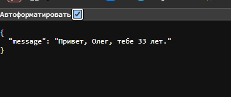

# craftteck_test

Для всех заданий есть код в папках task1, task2, task3

## Задание 1

Имея следующие таблицы:
```
Users (
id INTEGER PRIMARY KEY,
name TEXT,
email TEXT
);

Orders (
id INTEGER PRIMARY KEY,
user_id INTEGER,
total_amount REAL,
FOREIGN KEY (user_id) REFERENCES Users(id)
);
```
Запрос будет выглядеть так:
```
SELECT Users.name, SUM(Orders.total_amount) AS total
FROM Users
JOIN Orders ON Users.id = Orders.user_id
GROUP BY Users.id
HAVING SUM(Orders.total_amount) > 1000;
```

Выбираем name из Users, сумму затрат на заказ.<br>
Используем Join, чтобы найти все заказы по id пользователя для дальнейшей обработки.
Группировка по id пользователя, где сумма > 1000

Пример выполнения запроса:


## Задание 2
Для приложения Flask с заданными параметрами, (в данном случае host - localhost) ссылка будет выглядеть так:
```
http://localhost:3000/api/people?name=Олег&age=33
```

В ссылку преедаем данные Олег и возраст 33

Пример изпользования ссылки:



## Задание 3
Для того, чтобы выбрать только четные элементы списка можно использовать следующий код:
```
array = [1, 2, 3, 4, 5, 6, 7, 8]
result = [x for x in array if x % 2 == 0]
print(result)
```

Пример выполнения скрипта:


